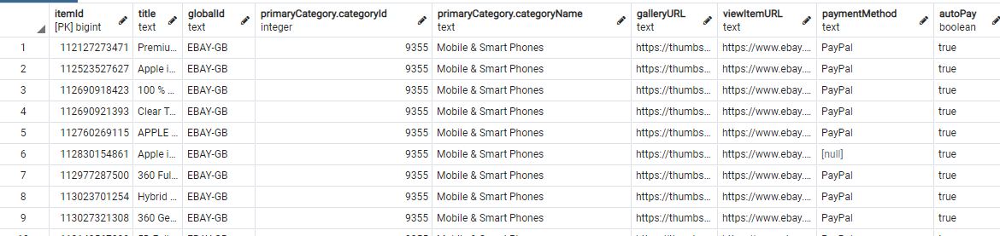
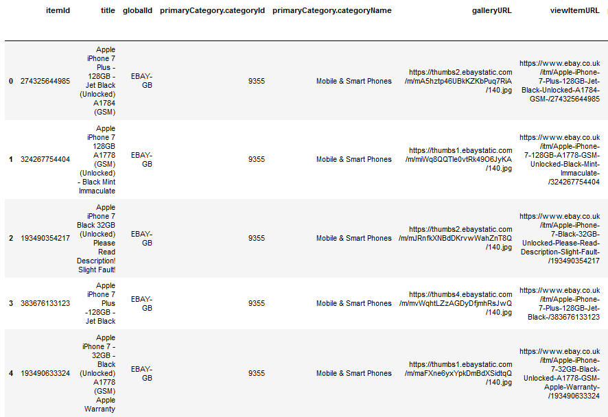
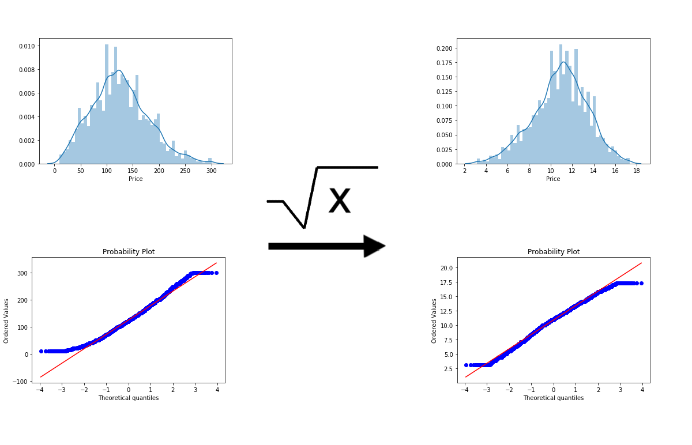

# eBay Iphone 7 Price Prediction Using Regression
It's difficult to tell when using eBay whether the item you are bidding on is overpriced, underpriced or about right. Wouldn't it be easier if there was a better way to find out what price an item will sell for? That way you don't over pay for an item, waste time bidding for an item that will eventually exceed your price range and can identify underpriced items.

This project aims to solve that problem. The goal of this project is to use regression to predict the price of eBay items (specifically Iphone 7s) so that you can know instantly what price an item will sell for, making the whole eBay process easier.

I got the idea to try and use machine learning to predict eBay price items after seeing @NathanZorndorf repo [here](https://github.com/NathanZorndorf/ebay-price-predictor) where he did something similar.

# 1. Web Scraping
To get the required information from eBay I used the eBay API along with the python wrapper [link](https://github.com/timotheus/ebaysdk-python). eBay only lets you see information for items that were listed in the last 90 days, so I collected data for about 21,000 completed listings. I used the keyword 'iPhone 7' and set the categoryId equal to 9355 (Cell Phones & Smartphones). I then saved all of the data in a postgres database.

I collected all of the standard information for each item using the Ebay Finding API, such as the title, postage price, final price, etc. Then I used the eBay Trading API to get the item specifics, for each itemId, such as 
* Colour
* Model
* Storage
* Network

My code limits the user to making a limited number of calls for a 24 hour period (10,000 for Finding and 5,000 for Trading) but if you were to collect data on a larger scale you can apply to extend this limit on the eBay API website. [API call limits](https://developer.ebay.com/support/api-call-limits)

# 2. Data Cleaning
For the data cleaning I used the python module Pandas. 

Out of a total of 380 columns, 305 were missing more than 50 of there data, I decided to drop the columns that had more than 50% of there data missing. I then filled in the remaining missing data points with the keyword 'None'. I also tried to remove data entries that had words unrelated to the keyword 'Iphone 7' for example if the item had the words 'case' or 'screen protector' they were dropped from the database. After all of the missing values were fixed I exported the data table to a pickle.

# 3. Data pre-processing
I thought that if a title had the word 'Plus' (relating to an Iphone 7 plus) in the title it would sell for more, but if the seller hadn't specifically specified that it was a Iphone 7 Plus in the item specifics the model might not make use of that fact. So I used Sklearn's TfidfVectorizer and CountVectorizer on the item title and description. I then used the top 100 words to create an extra 200 columns in the database to signify if a word appear in the title or description e.g. 'Plus in title'. I then calculated the correlation between each new category and the price then I kept the columns that showed any sort of correlation. Using this technique I managed to add an extra 21 columns. e.g.
Correlation with Price | Column
-----------------------|-------
0.23 | unlocked in title
0.32 | plus in title
-0.19 | faulty in title

# 4. Exploratory data analysis

I noticed there were outliers in the prices and decided to remove those values. I also noticed that there was a large number of items that sold for a lower price than expected. For example items that would sell for 0.99p so I assumed that these values weren't authentic and something else was going on e.g. ending an auction early to sell to a specific person. Because of this the data wasn't exactly normally distributed, so I applied a square transformation to try and make it look more like the normal distribution. But there are still a few outliers than may affect the model. 

I then calculated the correlations for each category with the ending price and plotted a selection of graphs to visual the relationships between variables, such as whether the day of the week the listing ends on has an impact on the price. Working out the top 10 negative correlations gives us the heatmap below.

.jpg)

# 5. Initial Modeling

I decided to use an 80,20 split for the training and test data. My goal was to make a model that used the input X for each data item to predict the Price (Y targets) for each item as accurately as possible.

As a baseline I'm going to compare the model to a simpler model where we just pick the median. So for every value in X_test we predict that the value will be the median value of the y_train. Then I compared the median values with the actual test values using the root mean squared error and the mean absolute percentage error metric. I decided to use the RMSE over the MAE because I wanted the model to be able to predict the tail prices, prices that were high but also still valid, but a similar model could be made using MAE to focus less on the tail prices.

Model | Root Mean Squared Error (£) | Mean Absolute Percentage Error (%)
------|-----------------------------------------|------------
Median Value | 53.47| 55.21

So our model needs to have a better RMSE than the median value model otherwise you might as well just pick the median value each time you try to estimate the value of an item.

For the initial modeling I used a selection of Sklearn models, all with default parameters, and evaluated them using cross fold validation, using 10 folds, then evaluated how well each model's RMSE on the test set. The top 4 best models were,

Model | Root Mean Squared Error (£) |  Mean Absolute Percentage Error (%)
------|---------------|---------
RandomForestRegressor| 25.39 | 19.06
GradientBoostingRegressor | 26.75 | 21.89
SVR	| 28.12 | 24.09  
NuSVR | 28.24 | 24.25

So we have models that do better than just predicting the median price each time but the percentage errors of the models are still high. 

# 6. Hyperparameter optimization

To try and improve the models I used RandomizedSearchCV to try and optimize the parameters and improve each model's score.

I decided to look at the top 4 models.

Model | Root Mean Squared Error (£) |  Mean Absolute Percentage Error (%) | Root Mean Squared Error Change (£)
------|---------------|---------|-------------------
RandomForestRegressor| 25.30| 19.04 |-0.09
GradientBoostingRegressor | 24.80 | 18.86 | -1.95
SVR	| 27.72 | 23.28 | -0.4
NuSVR | 27.31 | 22.47 | -0.93

The biggest improvement was with the GradientBoostingRegressor,but the result of the other models only had a slight improvement. Before deciding that was the best model I also tried an ensemble method with a different combination of models, the best model was a combination of the RandomForestRegressor and the GradientBoostingRegressor. I managed to reduce the RMSE by £0.07 but the mean percentage error still went up.

Model | Root Mean Squared Error (£) |  Mean Absolute Percentage Error (%)
------|---------------|---------
RandomForestRegressor & GradientBoostingRegressor | 25.32 | 19.86

# 7. Conclusion

The GradientBoostingRegressor provided the best results but with a mean percentage error of 18.86% it is still unreliable. So the end I wasn't able to create a highly accurate model. Although the model does significantly better than the baseline model of just predicting the median price, it would take a lot more fine tuning before I'd use it myself. If I was going to make the model more accurate I would try and collect more data, maybe a wider selection of items, and do more in depth data cleaning. 

If I wanted to create a model to buy, and then sell items, I would remove prices from the dataset that I know are higher than the prices offered by the eBay stores selling iPhones so that the model could would focus less on the tail end values and be able to price the median values more accurately. 

Even though the outcome wasn't as fruitful as I hoped, I still learnt a lot and hope to be able to create more accurate models in the future.
